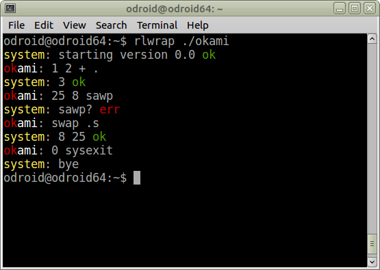

## What?

`okami` is a metamodern application development system that attempts to reduce technological wastefulness and complexity.
It is based on a non-standard dialect of Forth.

The current implementation is written in ARM (AArch32) assembly language and runs on GNU/Linux.
You can use it on a Raspberry Pi 2/3 and similar computers.

Forth may not exactly be modern technology, but I believe it can be in a productive partnership with it (like Unix is).
One unique advantage of Forth in todays world is that it allows for a system to be fully comprehensible, yet practical.

Example session:

## Features

* No type inference
* No operator overloading
* No pattern matching
* No type checking (neither static nor dynamic)
* No classes and objects and interfaces and mixins
* No closures
* No local variables
* Only you and the machine having an intelligent conversation to solve problems. :-)

Oh, and we actually have some nice libraries, don't use them.
Unless you understand them deeply and are sure they will actually make your life better.

## Requirements

- The ARM CPU it runs on needs to support the division instruction.
  This is the case e.g. on a Raspberry Pi 2, but not on a Raspberry Pi 1.
- For some features to work, the system needs to support little-endian mode.
  Most ARMs nowadays use little-endian anyway, though.
- Setting it up requires an assembler and linker.
  For convenience, `make` and `rlwrap` (for the REPL) are recommended.

No libraries are required, not even `libc`.
The interpreter is a small statically linked binary that uses Linux syscalls directly.

## Usage

Type `make` to assemble and link the interpreter.
You might have to change the name of the assembler and linker to just `as` and `ld`.
(I'm using a 64-bit system, so I use a cross-assembling toolchain.)

To reduce size by stripping debugging symbols, use `make tiny`.
The resulting binary size is currently about 6k.

Programs can be started with the `run` script or its `dev` symlink.
Using `dev` will load debugging support words.
(If you don't have the `rlwrap` utillity, change the `run` script accordingly.)

Using the `run` script and a `Runfile` (which contains a list of files to load) is the prefered method, but alternatively, you can also just do:

    $ ./okami lib/core.ok

This will read `core.ok` and enter the REPL.
(Note that `./run repl` also loads some development support words like `backtrace`.)
Running a program can be done by adding more files to process:

    $ ./okami lib/core.ok hello.ok

To not enter the REPL afterwards, a program source can finish with `bye`.

The `run`/`dev` script expects an argument, which can be either a file or a directory, in which case a file called `Runfile` is looked up in this directory.

Run tests with `./run tests` and start an interactive session with debugging support by using just `./dev`.

## Tutorial

Basic knowledge of Forth is required for this section.

`okami` is a Three-State-Forth:
It can be in interpret mode, compile mode or postpone mode.

You cannot set this state by executing a word or accessing a `state` variable.
Rather, the state is always explicit in the source code:
Square brackets `[]` are used to switch between the three states:

* In interpret mode, `[` will switch to compile mode.
* In compile mode, `[` will switch to postpone mode.
* In postpone mode, `]` will switch back to compile mode.
* In compile mode, `]` will switch back to interpret mode.
* Other uses of `[]` are invalid, i.e. don't use `]` in interpret mode or `[` in postpone mode.

Since code will be compiled if it is enclosed in square brackets, a basic definition looks like this:

    : 2dup [over over];

As you can see, `[]` are also treated as whitespace, i.e. they separate words.

There are no "immediate" words in `okami`.
That means that compilation directives like control structures must be placed outside of brackets so that they will be interpreted immediatelly:

    : max
      [2dup >] if [drop] else [nip] then ;

This makes it obvious that `if` `then` `else` are words that compile code, so a beginner is less likely to get confused and ask "Why will these only work in colon definitions?"
It might be less pretty (and sometimes less flexible), but makes it more obvious what actually happens, i.e. it results in a slightly less twisted mental model.

It also has the advantage of looking weird if you use multiple control structures in a single definition.
A definition should preferably contain no more than one control structure, so this helps to factor properly.

While such code looks syntactically similar to the increasingly popular Joy-style quotations, there is no semantic relation.
To make this very clear:
The square brackets are *not* used to create closure-like code blocks, as it is commonly done in various modern concatenative languages.
The `[]` merely denote a change of state (i.e. what the system does with the words it encounters in the source text), nothing else.

Since `okami` uses indirect threaded code, you don't *need* to use square brackets.
You can also compile a call manually by first pushing the desired code field address (CFA) onto the stack with `'` (tick) and then writing it into memory with `,` (comma):

    : sqr   ' dup , ' * , ;
    : cell+ ' lit , 4 , ' + , ;

This is sometimes useful e.g. to include constant values into compiled code:

    : colon? [lit] char : , [=?];

The square brackets extend naturally to postponing, i.e. the second level of nesting them works like `postpone` in standard Forth:
It compiles code which, when executed, will compile a call to the given word (and accordingly for constants).

    : {char} [[lit] char ,];
    : colon? {char} : [=?];

I tried to make most obvious optimizations in the interpreter.
For example, the dictionary is placed at the end of the memory area, so it doesn't interfere with cache utilization during long-running operations where no dictionary lookups are done anyway.
The dictionary grows downwards (i.e. we search forward) and looks like this:

    Diagram of the dictionary structure
    ===================================
    dp @ points to most recent entry:
    [       2 ] len of name (in cells)
    [   "allo"] entry name, cell 1
    ["t\0\0\0"] cell 2, padded with 0s
    [   ...   ] start addr of definition
    [   ...   ] end addr of definition
    next entry follows immediately:
    [       2 ]
    [   "2dup"] at least one \0 after..
    ["\0\0\0\0"] ..name, plus padding
    [   ...   ]
    [   ...   ]

We store the end of a definition so that we can easiely display a backtrace
(with the word `backtrace` (or `bt`) from `lib/dev/debug.ok`).
So `;` compiles a call to `exit` and stores the current address in the end address of the last definition.

As you can see above, there is no place anywhere to mark words as hidden.
This means a word can use itself recursively by stating its own name:

    : fact
      [0=?] if [1+] else [dup 1- fact *] then ;

Unfortunatly, the builtin words are currently in a separate dictionary.
So far I failed to create a linker script for GNU ld that makes a unified dictionary work.
This should be easy to fix with our own assembler, though.
One more example of using overcomplex tools not paying off...

One additional detail of the dictionary structure is that we can have sections of private definitions, which will be skipped when looking up names.
Those entries have the length of the name set to zero.
This zero value is followed up by the address of the next non-private dictionary entry.
This facillity is utilized by the `private{` ... `}in{` words.
You'll find plenty of examples in the library code.

In addition to `dp`, there is also `hp` (the `here` pointer), which is used for compiling and by words like `,` (comma).

The content of a definition (at least if it should be possible to execute it) begins with the code field.
So the "start address of the definition" field in the dictionary actually contains the CFA (code field address).

You can use `docol,` and `dodoes,` to make a colon definition or a "does" word.
Since you can create a dictionary entry with `entry:`, you could do:

    \ a working definition, although without
    \ proper end given in dictionary:
    entry: sqr docol, ' dup , ' * , ' exit ,

A "does" word needs an additional cell after the code field:
The address of the colon definition to execute.

To keep things simpler, we don't use standard "create does".
`create:` itself works as expected:

    create: buffer 256 allot
    : var: [create: 0,];

However, `does` is combined with the word `with` instead:

    : const: with [,] does [@];
    : array: with [cells allot]
             does [swap cells +];

A `begin` `while` `repeat` loop exists that works just like in standard Forth.
Additionally, there is a non-standard `rfor` `next` loop which pushes a terminating value on the return stack and compares the TOS with it on each iteration:

    : count rfor [dup . 1+] next ;
    5 10 count
    \ will display: 5 6 7 8 9

The `r` in `rfor` reminds you of the fact that it uses the return stack
(the upper bound will be stored there).

Not having immediate words has a few consequences.
For example, `is` works slightly differently in `okami`.
It takes two XTs from the stack:
For both the deferred word and the code that now defines it.
(The code of the deferred word is just a call and will be overwritten.)
This makes it easier to set the operation performed by the deferred word from compiled code.

You'll have to figure the rest out from the source code for now. :-)

