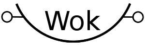

> The Systems Language With Batteries Excluded

# Welcome to `wok`

## What is Wok?

The name Wok stands for "Wolfgangs Offener Kompiler" (Wolfgang's Open Compiler).

- Wok is a statically-typed, concatenative (stack-based) systems programming language and, obviously, a compiler for this language.
- Wok provides more safety than C (e.g. mostly safe access to nullable pointers) and yet an easier way to do unsafe things via the `any` type.
- Wok acknowledges that stack-shuffling is confusing and tries hard to reduce its impact (without giving up on concatenativity). In other words: Wok wants to make concatenative programming more accessible without watering it down.
- Wok tries to provide a simple, yet pleasantly readable syntax with visual cues.
- Wok is independent of C - it has its own tiny runtime (<2K) and does not require libc.
- Wok is designed so that one can keep the full language in ones head (but provides enough convenience features to be practically useful).
- Wok generates straightforward code, i.e. no nasal-demon-defined behaviour, although at the cost of some performance.
- Wok is mostly inspired by Forth and Go.

## Status

Currently, it works with OpenBSD and GNU/Linux on x86-64, but is easy to port.

The latest pre-alpha version is 0.3.
It was released on 2021-02-14.

## Quick Intro

You can define variables

```
the answer: int
the questions: [42] int  ; array
```

And executable words

```
; multiplies a number with itself
def square (int :: int)
    [this *]

def ask ()
    [7 square 7 - answer !] 
```

The names of stack shuffling words are slightly different from most concatenative languages.

Wok    | Forth
-------|-------
this   | dup
that   | over
they   | 2dup
alt    | swap
.      | drop
nip    | nip
tuck   | tuck

Use `if` as a control structure

```
; remove the minus sign if it has one
def abs (int :: int)
    [this 0 < if:[0 alt -]]

def max (int int :: int)
    [they > if:[.] else:[nip]]
```

Non-nullable references are called addresses.

```
def zero! (@int)
    [0 alt !]

def inc! (@int :: @int)
    [this @ 1 + that !]
```

Nullable references are called pointers.
You need `with` to convert nullables to non-nullables.
Without it, you can not access their values.
`with` works similar to `if`.
The `else` branch will have the null reference dropped automatically.

```
; deref pointer or use default value
def val-or-0 (^int :: int)
    [with:[@] else:[0]]
```

You can define macros with `for`.
The tokens of the body will be inserted whenever the name is encountered.

```
for while {not if:[break]}
for until {    if:[break]}

def downto0 (int)
    [loop:[this 0 = until 1 -] .]
```

Currently, classes are actually just structs.

```
class Point {
  the x: int
  the y: int
}

the position: Point

def init ()
    [0 position 'x !  0 position 'y !]

def bottom? (Point :: bool)
    ['y @ 0 =]
```

## Requirements

- `nasm` as assembler (`pkg_add nasm` on OpenBSD, similar for GNU/Linux)
- a linker (GNU ld / ld.bfd, part of OpenBSD base)
- the current compiler prototype is written in Ruby, while the upcoming compiler prototype is written in Java; eventually the compiler will be self-hosting

## Getting started

The `welcome` program in the directory `apps` is an example that you can modify to try out Wok.
Make sure to comment/uncomment the syscall constants for your operating system.

## Questions?

You can discuss it on [/r/concatenative](https://old.reddit.com/r/concatenative) for now.
Hint: Use i.reddit.com on mobile to get a decent experience.
